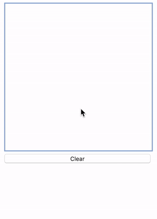

Machine Learning model that recognise numbers from 0 to 9 from a HTML Canvas.

## Model

Convolutional Neural Network - LeNet-5

## How to run locally
- [ ] `git clone` this repository
- [ ] `python api.py`
- [ ] Open html/index.html in your browser
